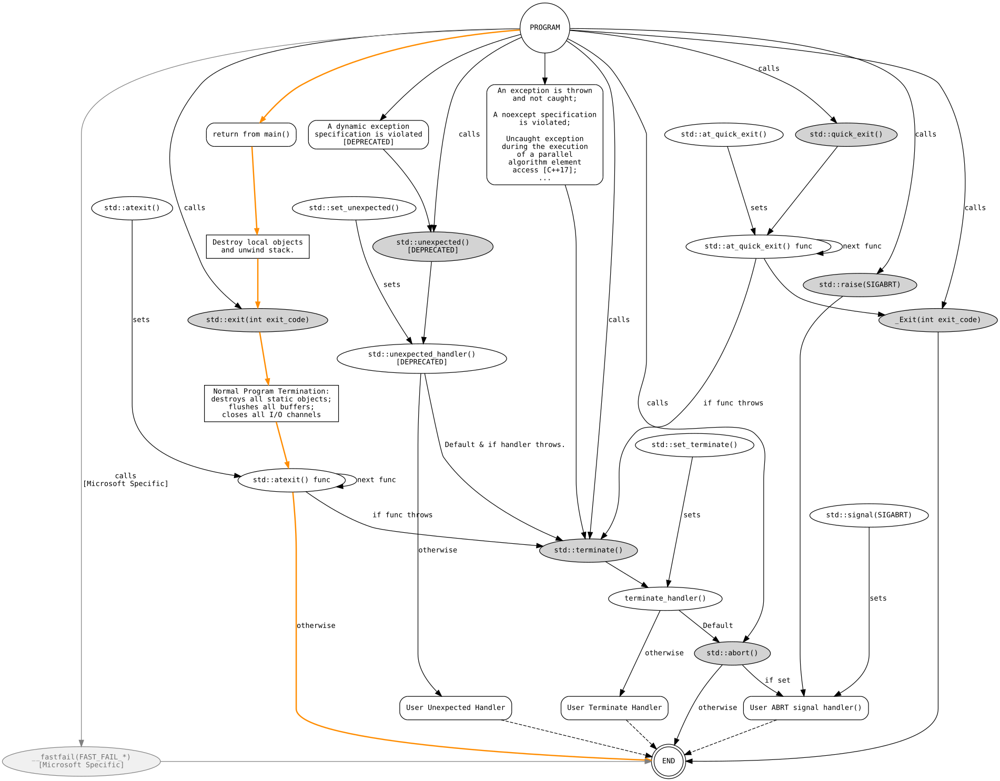

Terminators
===========

A GraphViz diagram that shows both normal and unexpected program termination flows in C++. 

There are multiple ways a C++ program may terminate. These include both normal and unexpected termination. 
This GraphViz diagram shows the program termination flows as defined by the standard.

